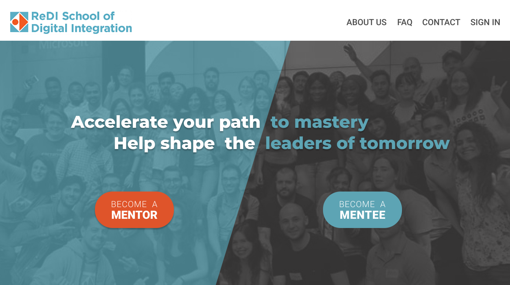

# Mentorship-Website-Design-in-Figma

PNG files with my desktop and mobile designs of The ReDi School Mentorship program pages. 
I designed it for my UX/UI Design course at ReDi School of Digital Integration. It was a hands-on course where I learned about design thinking, user-centered design, research, UX interviewing, insight synthesis, persona creation, decision mapping, prototyping, user testing, and design principles through building a mentorship website project using Figma.

You can see [here](https://youtu.be/rOwtY2WfAbM) the 2-minute video of the project that I used for the final project presentation at Redi School of Digital Integration.

